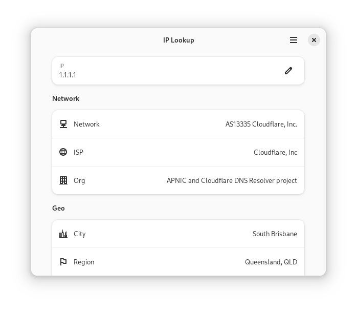
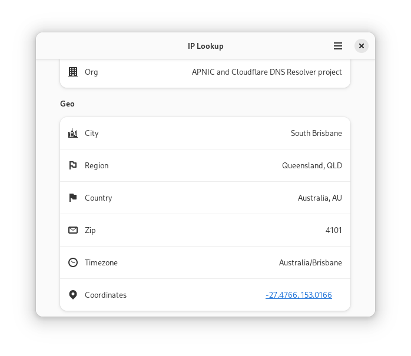

<h1 align="center">
	<br>
	IP Lookup
</h1>

Find info about an IP address.

# Screenshots




# Install

<a href='https://flathub.org/apps/io.github.bytezz.IPLookup'></a>

Or download [latest artifact zip](https://nightly.link/Bytezz/IPLookup-gtk/workflows/ci/main) for your architecture,
extract and install the enclosed flatpak.

## LibAdapta Support

To switch from default LibAdwaita to LibAdapta, set the environment variable `LIBADAPTA=1`:

```bash
flatpak override --user --env=LIBADAPTA=1
```